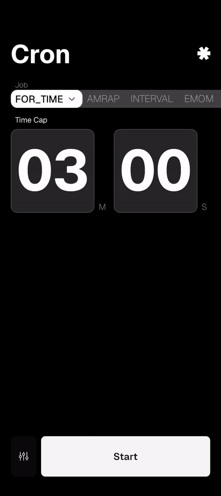

# cron

HIIT timer app.

Features:

- Timers:
  - FOR TIME: countdown to beat a target time
  - AMRAP: tracks rounds in a fixed time window
  - EMOM: rounds with a configurable interval duration
  - INTERVALS: alternating work/rest rounds
  - STOP WATCH: open-ended with checkpoint logging
- Big numbers, easy-to-read timer face

## usage

### installation

_Work In Progress_

### workflow

The app has two main screens. The default behavior is to open the app and see the main menu, which is a list of forms where you have to select the timer type you want to run and then set your custom timer's parameters.

Then press `Start`.

On the timer screen there are only 2 interactions:

- long press: pauses the timer and lets you finish (or resume) the timer.
- double tap: (only in AMRAP & STOP WATCH timers) registers a new checkpoint.

## motivation

I'm exhausted of barely legible apps. I think they miss the point of a HIIT timer app. Don't get me wrong, they do the job and work as expected, but the idea of a HIIT timer app is that you can see the time with ease even when you are exhausted and far away, like the wall timer ones.

I tried to take the same idea of a wall timer to my phone: big numbers, simple interface, and taking up as much screen real estate as possible.

## internals

This app is made with expo (react-native).

To launch local development:

1. clone this project
2. install dependencies `pnpm i`
3. make a prebuild `pnpm prebuild`
4. run local service `pnpm android` or `pnpm ios`

**note:** You need to have a [working local dev environment already](https://docs.expo.dev/get-started/set-up-your-environment/)

## faq

### why "cron"

Cron is a well-known time-based job scheduler in Unix systems, where the asterisk (\*) is heavily used as a wildcard to define recurring time intervals. **'Cron'** is also an abbreviation for **'chronometer'**.

### is this app vibecoded?

No. I had a clear vision for this app from the start. I use AI (like Gemini and Supermaven) strictly as an assistant for brainstorming and autocompletion, not to write the codebase for me.
